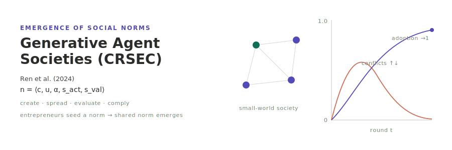

<p align="center"></p>

**English** | [日本語](README.ja.md)

# Emergence of Social Norms in Generative Agent Societies (CRSEC) — Ren et al. (2024)

A reimplementation of the CRSEC architecture of Ren et al. (2024), "Emergence of Social Norms in Generative Agent Societies: Principles and Architecture" (*IJCAI-24*, 7895–7903; arXiv:2403.08251). A population of LLM-driven agents sits on an (undirected) small-world social network. Each round every agent runs the norm life-cycle — **Creation & Representation → Spreading → Evaluation → Compliance** — over a personal-norm database. A few **norm entrepreneurs** seed initial norms; through conversation and observation those norms propagate, are sanity-checked and internalised, and a shared social norm **emerges and stabilises**. The paper's headline finding is that a shared injunctive norm is adopted by 100% of agents and social conflict almost vanishes.

This builds on the deterministic [socsim](https://github.com/akitenkrad/rs-social-simulation-tools) core (network, activation order, partner sampling, scheduling, metrics, the canonical-norm identity), while the non-deterministic LLM layer (norm creation / spreading / evaluation / compliance) is confined to the mechanisms and pseudo-determinised via the optional `socsim-llm` crate (prompt→response cache + `temperature=0` + fixed seed). CRSEC is **non-spatial**, so social contacts are a `socsim-net` Watts–Strogatz graph (ER/BA also available); there is no spatial grid.

## The personal-norm 5-tuple

Every norm is `n = ⟨c, u, α, s_act, s_val⟩`:

| field | meaning |
|-------|---------|
| `c` | natural-language content, e.g. "no smoking indoors" |
| `u` | utility `∈ [1, 100]` |
| `α` | type — **descriptive** ("people do X") or **injunctive** ("one should do X") |
| `s_act` | active flag |
| `s_val` | valid flag |

A norm is **qualified** iff `s_act ∧ s_val`. Norms identified during spreading enter the receiver's DB **un**qualified (`s_act = s_val = false`) and are promoted to qualified only after passing the evaluation sanity checks. Norm emergence is measured over the qualified set.

## Two-layer determinism (read this first)

LLM output is **outside** socsim's bit-reproducibility. The design splits into two layers:

- **Deterministic socsim core** — network generation, activation order (`RandomActivationScheduler`), conversation/observation partner sampling (`ctx.rng`, ChaCha20), scheduling, metrics, convergence, and the **canonical-norm identity** (see below). Given a seed this reproduces bit-for-bit.
- **Non-deterministic LLM layer** — norm creation, the spreading analysis (conflict detection + decide-to-talk + norm identification), the evaluation sanity checks, and compliance. Pseudo-determinised by `socsim-llm`'s `CachingClient` (a `hash(prompt+model)` → response cache), `temperature=0` and a fixed seed. The provider order is **Ollama first → OpenAI fallback** via `socsim-llm`'s `FallbackClient`.

The cache — not the model — is the reproducibility mechanism: a warm cache replays identical responses. Each run writes `run_metadata.json` recording the model, endpoint, temperature, seed and cache-hit rate. Because the local default model (`llama3.2:latest`) differs from the paper's GPT-3.5/4, reproduction targets are **qualitative** (adoption rises toward 1; conflicts rise then fall; injunctive norms emerge before descriptive ones), not exact numbers.

## Canonical-norm identity

LLM paraphrases of "the same" norm vary in wording, so the adoption rate buckets norms by a **canonical key**, selected with `--canonical-mode {rule|llm}`:

- **`rule`** (default) — a **deterministic, rule-based** normalisation (lowercase → strip non-alphanumerics → drop stopwords → dedup → sort → join). It requires **no extra LLM calls** and keeps the metric inside the deterministic core. It collapses word-order / article / subject variants but not lexically disjoint paraphrases.
- **`llm`** — an LLM judge decides whether two norm expressions denote the same norm (cached, `temperature=0`). It also merges lexically disjoint paraphrases (e.g. "no smoking indoors" ↔ "please refrain from cigarettes inside"). A rule-key match short-circuits the judge to save calls; the judge runs through the same cached client, so it is pseudo-deterministic. The `rule` path is byte-for-byte unchanged.

## Descriptive vs injunctive

The metrics split the adoption rate and the distinct-norm count by norm type — **injunctive** ("one should …") vs **descriptive** ("people do …") — and record the per-type time-to-emergence. This surfaces the paper's ordering effect (Fact 7): injunctive norms emerge before descriptive ones. The `reproduce` subcommand reports the contrast and the Python `reproduce` tool draws the two type-split trajectories.

## Install & Quick start

```bash
# Build the Rust simulation (fetches socsim incl. socsim-net + socsim-llm with the Ollama+OpenAI backends)
cargo build --release

# Make sure a local Ollama is running and a model is pulled, e.g.:
#   ollama pull llama3.2:latest
export OLLAMA_HOST=http://localhost:11434
export OLLAMA_MODEL=llama3.2:latest
# Optional OpenAI fallback:
#   export OPENAI_API_KEY=sk-...   OPENAI_MODEL=gpt-4o-mini

# Run a small society (Watts–Strogatz, 3 entrepreneurs)
cargo run --release -- run --population 10 --entrepreneurs 3 --network ws --ws-k 4 --ws-beta 0.1 --rounds 48 --seed 42

# LLM-judged canonical-norm identity (cached); the rule default is bit-identical
cargo run --release -- run --canonical-mode llm --population 10 --rounds 48 --seed 42

# Reproduce the paper's headline findings (emergence / consolidation / conflict rise-then-fall / Fact 7)
cargo run --release -- reproduce --population 12 --runs 3 --rounds 48 --seed 42

# Offline (no live LLM): the --mock flag drives run / reproduce with a deterministic scripted client
cargo run --release -- reproduce --mock
cargo run --release -- run --mock --population 8 --rounds 12

# Offline smoke (no live LLM): mock-driven, exercises the whole pipeline
cargo run --release --example mock_smoke -- results

# Install the Python visualization tools (at the workspace root)
uv sync

# Visualize the most recent run (emergence curves, conflict time series, distinct norms)
uv run crsec-tools visualize

# Reproduce the paper's findings end-to-end and draw the figures (offline with --mock)
uv run crsec-tools reproduce --run --mock

# Inspect the run's settings and LLM metadata
uv run crsec-tools show-experiment-settings --results-dir results/latest
```

## Documentation

- [Use cases](docs/usecases.md) — what you can do with this project, with pointers to the rest of the docs.
- [CLI](docs/cli.md) — the Rust CLI: the `run`, `sweep` and `reproduce` subcommands and their flags (incl. `--canonical-mode` and `--mock`), plus the LLM environment variables.
- [Visualization](docs/visualization.md) — the Python `crsec-tools` and how to interpret the outputs.
- [Architecture](docs/architecture.md) — repository structure, the two-layer determinism, the socsim/`socsim-llm`/`socsim-net` framework, the CRSEC life-cycle → mechanism mapping, the metrics, and references.

## Scope

The repository covers the `CrsecWorld` and the six life-cycle mechanisms, the two-layer LLM client (Ollama→OpenAI fallback + caching), the `run` / `sweep` / `reproduce` subcommands, the emergence metrics with the descriptive-vs-injunctive split, both canonical-norm-identity modes (`rule` / `llm`), and the Python `visualize` / `visualize-sweep` / `show-experiment-settings` / `reproduce` tools. Long-term abstraction synthesis uses the basic θ rule; LLM-based abstraction is a documented extension point.

## License

MIT

---
*This file was generated by Claude Code.*
